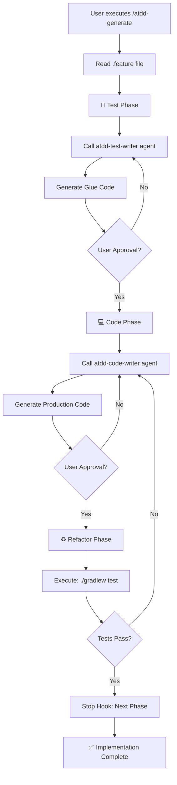

# /atdd-generate - Feature to Implementation

## Usage

```
/atdd-generate <feature-file>
```

## Steps

1. .feature 파일을 확인합니다
2. **Test Phase**: atdd-test-writer 에이전트를 호출하여 Glue Code를 생성합니다
3. 사용자 승인을 요청합니다
4. **Code Phase**: atdd-code-writer 에이전트를 호출하여 Production Code를 생성합니다
5. 사용자 승인을 요청합니다
6. **Refactor Phase**: 테스트를 실행합니다 (`./gradlew test`)
7. Stop hook을 호출하여 다음 단계로 전이합니다

## Agent Invocation Methods

### Phase 1: Test (atdd-test-writer)

Glue Code를 생성하는 에이전트를 호출합니다:

```yaml
agent: atdd-test-writer
inputs:
  feature_file: "src/test/resources/features/{feature-name}.feature"
  context:
    project_type: "java-spring"
    test_folder: "src/test/java"
    glue_package: "com.example.glue"
```

**출력 형식:**
```java
// Glue Code (Cucumber Step Definitions)
@Given("a logged-in user with an empty shopping cart")
public void a_logged_in_user_with_an_empty_shopping_cart() {
    // Implementation
}
```

### Phase 2: Code (atdd-code-writer)

Production Code를 생성하는 에이전트를 호출합니다:

```yaml
agent: atdd-code-writer
inputs:
  feature_file: "src/test/resources/features/{feature-name}.feature"
  glue_code: "src/test/java/.../StepDefinitions.java"
  context:
    project_type: "java-spring"
    source_folder: "src/main/java"
    package: "com.example.service"
```

**출력 형식:**
```java
// Production Code
@Service
public class ShoppingCartService {
    public void addItem(Product product) {
        // Implementation
    }
}
```

## Step-by-Step Approval Process

각 Phase 완료 후 사용자 승인을 요청합니다:

### Test Phase 승인
```
✅ Test Phase 완료

생성된 Glue Code:
- src/test/java/com/example/glue/ShoppingCartSteps.java
- 12개의 Step Definitions 정의됨

검토 후 승인하시겠습니까? (y/n)
```

### Code Phase 승인
```
✅ Code Phase 완료

생성된 Production Code:
- src/main/java/com/example/service/ShoppingCartService.java
- src/main/java/com/example/domain/ShoppingCart.java

검토 후 승인하시겠습니까? (y/n)
```

### Refactor Phase (자동 실행)
테스트 실행은 사용자 승인 없이 자동으로 수행됩니다:

```bash
./gradlew test
```

## Test Command

```bash
./gradlew test --tests "*Cucumber*" --info
```

**테스트 성공 조건:**
- 모든 Cucumber 시나리오가 통과해야 함
- 빌드가 성공적으로 완료되어야 함

**테스트 실패 시:**
- 실패한 시나리오를 보고함
- atdd-code-writer 에이전트를 재호출하여 Production Code 수정

## Stop Hook (단계 전이 자동화)

Stop hook은 각 Phase 완료 후 자동으로 호출되어 다음 단계를 준비합니다.

### Hook 생성 위치
```
.claude/scripts/atdd-hook.sh
```

### Hook 기능
1. 현재 Phase 상태 저장 (`.atdd-state.json`)
2. 다음 단계 안내 메시지 출력
3. 필요한 경우 자동화된 작업 수행

## Skill Flow



## Output Locations

### Test Phase Outputs
```
src/test/java/
├── com/example/glue/
│   └── {Feature}Steps.java      # Step Definitions
└── com/example/runners/
    └── CucumberTest.java        # Test Runner (if needed)
```

### Code Phase Outputs
```
src/main/java/
├── com/example/domain/
│   └── {Domain}.java            # Domain Models
├── com/example/service/
│   └── {Service}.java           # Business Logic
└── com/example/controller/
    └── {Controller}.java        # REST Controllers (if needed)
```

## State Management

ATDD 진행 상태는 `.atdd-state.json` 파일에 저장됩니다:

```json
{
  "current_phase": "code",
  "feature_file": "src/test/resources/features/shopping-cart.feature",
  "generated_files": [
    "src/test/java/com/example/glue/ShoppingCartSteps.java"
  ],
  "test_results": {
    "last_run": "2026-02-04T21:30:00Z",
    "status": "passed",
    "scenarios": {
      "total": 5,
      "passed": 5,
      "failed": 0
    }
  }
}
```

## Example

### Input .feature file

```gherkin
Feature: Shopping Cart Management

  Scenario: Add item to shopping cart
    Given a logged-in user with an empty shopping cart
    When the user adds "Product A" to the cart
    Then the shopping cart should contain "Product A"
    And the cart total should reflect the item price
```

### Phase 1: Test Output

```java
// src/test/java/com/example/glue/ShoppingCartSteps.java
package com.example.glue;

import io.cucumber.java.en.Given;
import io.cucumber.java.en.When;
import io.cucumber.java.en.Then;
import static org.assertj.core.api.Assertions.assertThat;

public class ShoppingCartSteps {

    private ShoppingCart cart;

    @Given("a logged-in user with an empty shopping cart")
    public void a_logged_in_user_with_an_empty_shopping_cart() {
        cart = new ShoppingCart();
        assertThat(cart.isEmpty()).isTrue();
    }

    @When("the user adds {string} to the cart")
    public void the_user_adds_to_the_cart(String productName) {
        cart.addProduct(new Product(productName, 10000));
    }

    @Then("the shopping cart should contain {string}")
    public void the_shopping_cart_should_contain(String productName) {
        assertThat(cart.contains(productName)).isTrue();
    }

    @Then("the cart total should reflect the item price")
    public void the_cart_total_should_reflect_the_item_price() {
        assertThat(cart.getTotal()).isEqualTo(10000);
    }
}
```

### Phase 2: Code Output

```java
// src/main/java/com/example/domain/ShoppingCart.java
package com.example.domain;

import java.util.ArrayList;
import java.util.List;

public class ShoppingCart {
    private final List<Product> products = new ArrayList<>();

    public void addProduct(Product product) {
        products.add(product);
    }

    public boolean contains(String productName) {
        return products.stream()
            .anyMatch(p -> p.getName().equals(productName));
    }

    public int getTotal() {
        return products.stream()
            .mapToInt(Product::getPrice)
            .sum();
    }

    public boolean isEmpty() {
        return products.isEmpty();
    }
}

// src/main/java/com/example/domain/Product.java
package com.example.domain;

public class Product {
    private final String name;
    private final int price;

    public Product(String name, int price) {
        this.name = name;
        this.price = price;
    }

    public String getName() {
        return name;
    }

    public int getPrice() {
        return price;
    }
}
```

### Phase 3: Test Execution

```bash
$ ./gradlew test

> Task :test
✅ 5 scenarios passed (0 failed)
✅ Build completed successfully
```

## Best Practices

1. **테스트 우선 작성**: Production Code보다 Glue Code를 먼저 작성합니다
2. **점진적 구현**: 실패하는 테스트를 통과하는 최소한의 코드만 작성합니다
3. **리팩터링**: 테스트 통과 후 코드를 개선합니다
4. **상태 저장**: 각 Phase 완료 후 상태를 저장하여 중단되어도 재개할 수 있게 합니다
5. **사용자 승인**: 자동화된 흐름 속에서도 중요한 결정 지점에서 사용자 확인을 받습니다
