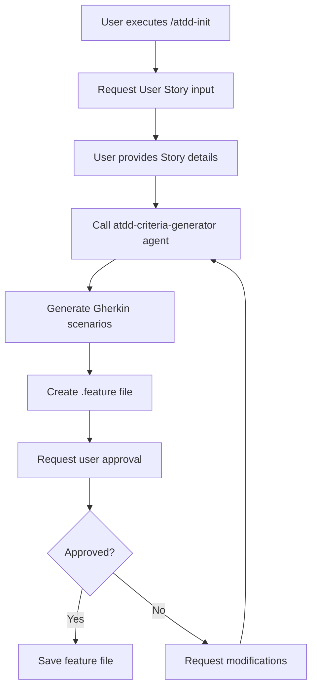

# /atdd-init - User Story to Gherkin Feature

## Usage

```
/atdd-init
```

## Steps

1. User Story를 입력받습니다
2. atdd-criteria-generator 에이전트를 호출하여 Gherkin AC를 생성합니다
3. .feature 파일로 저장합니다
4. 사용자 승인을 요청합니다

## User Input Guide

이 스킬을 실행하면 다음 정보를 입력해야 합니다:

1. **User Story 제목**: 기능에 대한 간단한 설명
   - 예: "사용자 로그인", "상품 검색", "장바구니 담기"

2. **사용자 역할 (Actor)**: 누가 수행하는가?
   - 예: "로그인한 사용자", "관리자", "방문자"

3. **목표 (Goal)**: 무엇을 하려고 하는가?
   - 예: "시스템에 로그인한다", "상품을 검색한다"

4. **비즈니스 가치 (Business Value)**: 왜 필요한가?
   - 예: "개인화된 서비스를 제공하기 위해", "구매를 위해"

## Agent Invocation Method

### atdd-criteria-generator 에이전트 호출

이 스킬은 `atdd-criteria-generator` 에이전트를 호출하여 User Story로부터 Gherkin 형식의 Acceptance Criteria를 생성합니다.

에이전트 호출 방법:

```yaml
agent: atdd-criteria-generator
inputs:
  user_story: |
    As a <역할>
    I want to <목표>
    So that <비즈니스 가치>
  context:
    project_type: "java-spring"
    feature_folder: "src/test/resources/features"
```

### 에이전트 출력 형식

`atdd-criteria-generator` 에이전트는 다음 형식으로 출력해야 합니다:

```gherkin
Feature: [Feature Name]

  Scenario: [Scenario Title]
    Given [전제 조건]
    When [행동]
    Then [기대 결과]
    And [추가 조건/결과]
```

## Skill Flow



## Output Location

생성된 .feature 파일은 다음 위치에 저장됩니다:

```
src/test/resources/features/{feature-name}.feature
```

파일 이름은 kebab-case로 변환됩니다:
- "User Authentication" → `user-authentication.feature`
- "Shopping Cart" → `shopping-cart.feature`

## Example

### Input

```
As a logged-in user
I want to add items to my shopping cart
So that I can purchase them later
```

### Generated .feature file

```gherkin
Feature: Shopping Cart Management

  Scenario: Add item to shopping cart
    Given a logged-in user with an empty shopping cart
    When the user adds "Product A" to the cart
    Then the shopping cart should contain "Product A"
    And the cart total should reflect the item price
```
