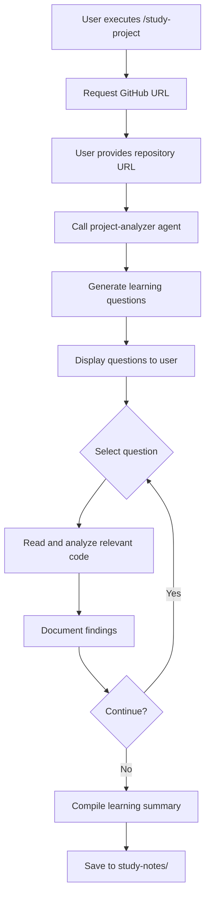

# /study-project - Open-Source Project Lesson Learning

## Usage

```
/study-project <github-url>
```

예시:
```
/study-project https://github.com/owner/repo
```

## Steps

1. GitHub Repository URL을 입력받습니다
2. 프로젝트를 분석하여 학습 질문을 자동 생성합니다
3. 질문 기반 탐색을 통해 프로젝트를 학습합니다
4. 학습한 내용을 정리하여 저장합니다

## User Input Guide

이 스킬을 실행하면 다음 정보를 입력해야 합니다:

1. **GitHub Repository URL**: 분석할 오픈소스 프로젝트
   - 예: `https://github.com/spring-projects/spring-framework`
   - 예: `https://github.com/nodejs/node`

2. **학습 목적** (선택): 무엇을 배우고 싶은가?
   - 예: "아키텍처 패턴 이해"
   - 예: "테스트 전략 학습"
   - 예: "API 디자인 패턴"

## Question-Driven Workflow

이 스킬은 질문 기반 탐색(Exploratory Learning) 방식을 사용합니다:

### 질문 생성 단계

프로젝트 분석을 통해 자동으로 학습 질문을 생성합니다:

**예시 질문 카테고리:**
- **아키텍처**: 프로젝트의 전체 구조는 어떻게 되어 있는가?
- **디자인 패턴**: 어떤 디자인 패턴이 사용되었는가?
- **테스트**: 테스트는 어떻게 구성되어 있는가?
- **API**: 공개 API는 어떻게 설계되었는가?
- **문서화**: 문서화는 어떻게 관리되는가?

### 탐색 단계

각 질문에 대해 다음 과정을 반복합니다:

1. **질문 선택**: 학습할 질문을 선택합니다
2. **코드 분석**: 관련 코드를 읽고 분석합니다
3. **학습 내용 정리**: 발견한 내용을 기록합니다
4. **다음 질문**: 다음 질문으로 넘어가거나 종료합니다

## Agent Invocation Method

### project-analyzer 에이전트 호출

이 스킬은 `project-analyzer` 에이전트를 호출하여 프로젝트 구조를 분석하고 학습 질문을 생성합니다.

에이전트 호출 방법:

```yaml
agent: project-analyzer
inputs:
  github_url: "https://github.com/owner/repo"
  learning_goal: "아키텍처 패턴 이해"
  context:
    analysis_depth: "medium"
    focus_areas:
      - "architecture"
      - "design-patterns"
      - "testing"
```

### 에이전트 출력 형식

`project-analyzer` 에이전트는 다음 형식으로 출력해야 합니다:

```markdown
## Project Analysis

### Overview
[프로젝트 개요]

### Suggested Learning Questions

1. **아키텍처**
   - Q: 프로젝트의 전체 구조는 어떻게 되어 있는가?
   - A: [관련 파일 경로와 분석 포인트]

2. **디자인 패턴**
   - Q: 어떤 디자인 패턴이 사용되었는가?
   - A: [관련 파일 경로와 분석 포인트]

3. **테스트**
   - Q: 테스트는 어떻게 구성되어 있는가?
   - A: [관련 파일 경로와 분석 포인트]
```

## Skill Flow



## State Management

학습 진행 상태는 `.study-state.json` 파일에 저장됩니다:

```json
{
  "github_url": "https://github.com/owner/repo",
  "current_question_index": 2,
  "answered_questions": [
    {
      "question": "프로젝트의 전체 구조는 어떻게 되어 있는가?",
      "answer": "...",
      "files_analyzed": [
        "src/main/java/...",
        "README.md"
      ],
      "timestamp": "2026-02-05T00:00:00Z"
    }
  ],
  "learning_notes_path": "study-notes/owner/repo/"
}
```

상태 파일을 통해:
- 중단된 학습 세션 재개
- 이미 분석한 파일 추적
- 학습 진행률 시각화

## Output Location

학습 결과는 다음 위치에 저장됩니다:

```
study-notes/
├── {owner}/
│   └── {repo}/
│       ├── README.md           # 학습 요약
│       ├── architecture.md     # 아키텍처 분석
│       ├── design-patterns.md  # 디자인 패턴 분석
│       ├── testing.md          # 테스트 전략 분석
│       └── findings/           # 발견한 사항들
│       └── .study-state.json   # 진행 상태
```

파일 이름 규칙:
- Repository URL: `https://github.com/spring-projects/spring-framework`
- Output Path: `study-notes/spring-projects/spring-framework/`

## Example

### Input

```
/study-project https://github.com/spring-projects/spring-boot
```

### Generated Questions

```markdown
## Spring Boot Project Analysis

### Suggested Learning Questions

1. **프로젝트 구조**
   - Q: Spring Boot의 모듈 구성은 어떻게 되어 있는가?
   - Explore: `spring-boot-project/spring-boot/`, `spring-boot-project/spring-boot-autoconfigure/`

2. **자동 설정 메커니즘**
   - Q: @EnableAutoConfiguration은 어떻게 작동하는가?
   - Explore: `spring-boot-autoconfigure/src/main/java/org/springframework/boot/autoconfigure/`

3. **스타터 의존성**
   - Q: spring-boot-starter-* 의존성은 어떻게 구성되는가?
   - Explore: `spring-boot-starters/` 디렉토리

4. **테스트 전략**
   - Q: Spring Boot는 어떻게 테스트를 지원하는가?
   - Explore: `spring-boot-test/` 모듈
```

### Learning Session Flow

```markdown
### Question 1: Spring Boot의 모듈 구성은 어떻게 되어 있는가?

**Files Analyzed:**
- spring-boot-project/README.md
- spring-boot-project/spring-boot/build.gradle
- spring-boot-project/settings.gradle

**Findings:**
1. **core 모듈**: 핵심 기능 제공 (ApplicationContext, SpringApplication)
2. **autoconfigure 모듈**: 자동 설정 지원 (META-INF/spring.factories)
3. **actuator 모듈**: 모니터링 및 관리 기능
4. **starters 모듈**: 편리한 의존성 모음

**Insight:** 모듈 간 의존성은 한 방향으로만 흐르도록 설계됨

---

### Question 2: @EnableAutoConfiguration은 어떻게 작동하는가?

[Similar analysis...]

---

## Learning Summary

Total Questions: 4
Answered: 2/4
Key Learnings:
- Spring Boot는 모듈형 아키텍처 사용
- 자동 설정은 spring.factories 메커니즘 기반
- [More findings...]

Next Steps:
- Continue with remaining questions
- Deep dive into specific modules
```

## Best Practices

1. **질문 중심 학습**: 코드를 읽을 때 명확한 질문을 가지고 접근합니다
2. **점진적 탐색**: 모든 코드를 한 번에 읽지 않고, 질문 단위로 나눕니다
3. **문서화**: 발견한 내용을 즉시 기록합니다 (기억 의존 최소화)
4. **상태 저장**: 학습 세션을 언제든 중단하고 재개할 수 있게 합니다
5. **재사용 가능한 노트**: 학습 노트는 나중에 참조할 수 있게 정리합니다

## Integration with Other Skills

- **/atdd-init**: 학습한 패턴을 실제 프로젝트에 적용할 때 사용
- **/atdd-generate**: 배운 테스트 전략을 구현할 때 사용
