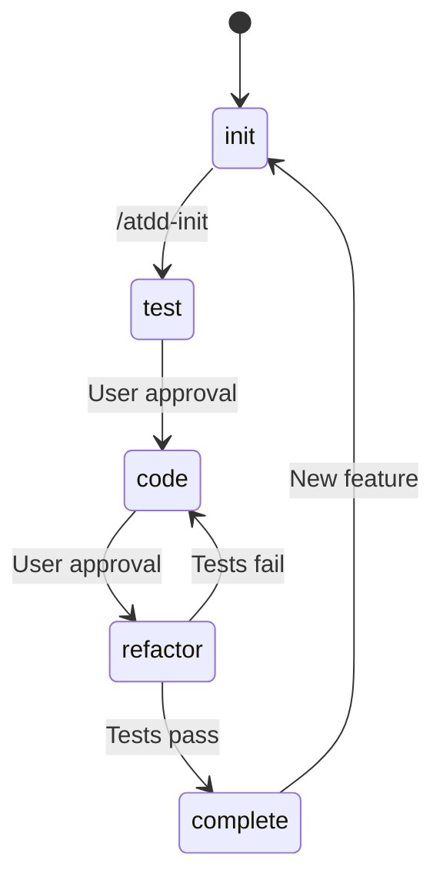
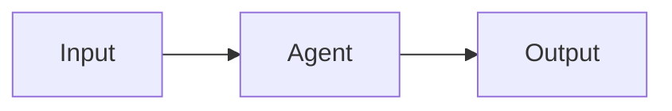

# ATDD-TDD Workflow Architecture

## System Overview

### Design Philosophy

The ATDD-TDD Workflow is built on the principle of **progressive refinement** - transforming abstract requirements into concrete, testable, and working code through a structured pipeline. The system:

1. **Separates Concerns**: Each agent has a single, well-defined responsibility
2. **Maintains State**: Tracks progress through the ATDD phases
3. **Enables Human Oversight**: Requires user approval at critical decision points
4. **Follows TDD Principles**: Test First, Code Second, Refactor Last

### Technology Stack

| Component | Technology | Version |
|-----------|------------|---------|
| Runtime | Claude Code CLI | Latest |
| Language | Java | 17+ |
| Framework | Spring Boot | 3.2+ |
| Testing | Cucumber, REST Assured, Testcontainers | 7.14+, 5.3+, 1.19.8+ |
| Database | MySQL (via Testcontainers) | 8.0 |

### Component Diagram

```
┌─────────────────────────────────────────────────────────────┐
│                    Claude Code Runtime                      │
├─────────────────────────────────────────────────────────────┤
│                                                             │
│  ┌──────────────────────────────────────────────────────┐  │
│  │              Skill Layer                             │  │
│  │                                                       │  │
│  │  ┌────────────┐         ┌────────────────┐          │  │
│  │  │ atdd-init  │────────▶│criteria-gen    │          │  │
│  │  │  Skill     │         │   Agent        │          │  │
│  │  └────────────┘         └────────────────┘          │  │
│  │       │                        │                     │  │
│  │       │                        v                     │  │
│  │       │                  .feature file               │  │
│  │       │                        │                     │  │
│  │       v                        v                     │  │
│  │  ┌─────────────────────────────────────────┐        │  │
│  │  │           atdd-generate Skill            │        │  │
│  │  │                                         │        │  │
│  │  │  ┌──────────────────────────────────┐   │        │  │
│  │  │  │ Phase 1: Test (Red)              │   │        │  │
│  │  │  │ ┌────────────┐                  │   │        │  │
│  │  │  │ │test-writer │                  │   │        │  │
│  │  │  │ │   Agent    │                  │   │        │  │
│  │  │  │ └────────────┘                  │   │        │  │
│  │  │  └──────────────────────────────────┘   │        │  │
│  │  │           │                             │        │  │
│  │  │           v                             │        │  │
│  │  │  ┌──────────────────────────────────┐   │        │  │
│  │  │  │ Phase 2: Code (Green)            │   │        │  │
│  │  │  │ ┌────────────┐                  │   │        │  │
│  │  │  │ │code-writer │                  │   │        │  │
│  │  │  │ │   Agent    │                  │   │        │  │
│  │  │  │ └────────────┘                  │   │        │  │
│  │  │  └──────────────────────────────────┘   │        │  │
│  │  │           │                             │        │  │
│  │  │           v                             │        │  │
│  │  │  ┌──────────────────────────────────┐   │        │  │
│  │  │  │ Phase 3: Refactor (Verify)       │   │        │  │
│  │  │  │ ./gradlew test                   │   │        │  │
│  │  │  └──────────────────────────────────┘   │        │  │
│  │  └─────────────────────────────────────────┘        │  │
│  └──────────────────────────────────────────────────────┘  │
│                                                             │
│  ┌──────────────────────────────────────────────────────┐  │
│  │              Hook System                             │  │
│  │                                                       │  │
│  │  ┌────────────┐  ┌────────────┐  ┌──────────────┐   │  │
│  │  │ atdd-stop  │  │ atdd-test  │  │  state.json  │   │  │
│  │  │   trigger  │  │   trigger  │  │              │   │  │
│  │  └────────────┘  └────────────┘  └──────────────┘   │  │
│  └──────────────────────────────────────────────────────┘  │
│                                                             │
└─────────────────────────────────────────────────────────────┘
```

## Architecture Patterns

### 1. Orchestrator-Agent Pattern

#### Description

The **Orchestrator-Agent Pattern** delegates specialized tasks to dedicated agents while maintaining centralized coordination.

#### Components

1. **Orchestrator** (Skills):
   - `atdd-init`: Coordinates User Story → Gherkin transformation
   - `atdd-generate`: Coordinates the full ATDD implementation cycle

2. **Agents**:
   - `atdd-criteria-generator`: Gherkin generation specialist
   - `atdd-test-writer`: Test code generation specialist
   - `atdd-code-writer`: Production code generation specialist

#### Data Flow

```
User Request
    |
    v
[Orchestrator: atdd-init]
    | 1. Parse User Story
    | 2. Extract requirements
    v
[Agent: atdd-criteria-generator]
    | 3. Generate Gherkin scenarios
    v
Output: .feature file
```

```
Feature File
    |
    v
[Orchestrator: atdd-generate]
    | 1. Read .feature
    v
[Agent: atdd-test-writer] (Phase 1)
    | 2. Generate Step Definitions
    v
User Approval
    |
    v
[Agent: atdd-code-writer] (Phase 2)
    | 3. Generate Production Code
    v
User Approval
    |
    v
[Test Runner] (Phase 3)
    | 4. Execute tests
    v
Output: Passing tests + Production code
```

#### Benefits

- **Separation of Concerns**: Each agent focuses on one task
- **Reusability**: Agents can be called independently
- **Testability**: Each agent can be tested in isolation
- **Maintainability**: Changes to one agent don't affect others

### 2. Skill-Hook Integration

#### Description

**Hooks** provide lifecycle callbacks that execute at specific points during skill execution, enabling state management and phase transitions.

#### Hook Types

| Hook Name | Trigger | Purpose |
|-----------|---------|---------|
| `atdd-stop` | `afterSkill` | Phase transition automation |
| `atdd-test` | `manual` | On-demand test execution |

#### Hook Configuration

```json
{
  "hooks": {
    "atdd-stop": {
      "description": "ATDD phase transition automation",
      "command": "bash .claude/scripts/atdd-hook.sh",
      "trigger": "afterSkill"
    },
    "atdd-test": {
      "description": "ATDD test execution hook",
      "command": "./gradlew test --tests \"*Cucumber*\"",
      "trigger": "manual"
    }
  },
  "skills": {
    "atdd-generate": {
      "hooks": {
        "onStop": "atdd-stop"
      }
    }
  }
}
```

#### State Machine

```bash
# .claude/scripts/atdd-hook.sh

Phase Transitions:
  init -> test -> code -> refactor -> complete

State Persistence:
  .atdd-state.json stores:
  - current_phase
  - feature_file
  - generated_files
  - test_results
```

#### State JSON Structure

```json
{
  "current_phase": "code",
  "feature_file": "src/test/resources/features/shopping-cart.feature",
  "status": "completed",
  "generated_files": [
    "src/test/java/com/example/glue/ShoppingCartSteps.java"
  ],
  "test_results": {
    "last_run": "2026-02-04T21:30:00Z",
    "status": "passed",
    "scenarios": {
      "total": 5,
      "passed": 5,
      "failed": 0
    }
  },
  "created_at": "2026-02-04T20:00:00Z",
  "updated_at": "2026-02-04T21:30:00Z"
}
```

### 3. State Management

#### State File Location

`.atdd-state.json` (project root)

#### State Transitions



#### State Persistence

```bash
# Update state (called by hook)
update_state() {
    local phase="$1"
    local feature_file="$2"
    local status="$3"

    jq -n \
       --arg phase "$phase" \
       --arg feature "$feature_file" \
       --arg status "$status" \
       '{
           current_phase: $phase,
           feature_file: $feature,
           status: $status,
           updated_at: now | todate
       }' > .atdd-state.json
}
```

#### Colored Output

```bash
# Color definitions
RED='\033[0;31m'
GREEN='\033[0;32m'
YELLOW='\033[1;33m'
BLUE='\033[0;34m'
NC='\033[0m'

log_success() {
    echo -e "${GREEN}[SUCCESS]${NC} $1"
}

log_error() {
    echo -e "${RED}[ERROR]${NC} $1"
}
```

## Component Deep Dive

### Skills

#### `/atdd-init`

**Location:** `.claude/skills/atdd-init/SKILL.md`

**Purpose:** Transform User Story into Gherkin Feature file

**Input:**
```yaml
user_story: |
  As a <role>
  I want to <goal>
  So that <business value>
```

**Output:**
```gherkin
Feature: [Feature Name]

  Scenario: [Scenario Title]
    Given [precondition]
    When [action]
    Then [expected outcome]
```

**Workflow:**
1. Request User Story from user
2. Call `atdd-criteria-generator` agent
3. Generate .feature file
4. Request user approval
5. Save to `src/test/resources/features/`

**Allowed Tools:**
- Task (for agent invocation)
- Write (for file creation)
- Read (for verification)
- Edit (for modifications)

**Disallowed Tools:**
- Bash (prevents shell execution during init)

#### `/atdd-generate`

**Location:** `.claude/skills/atdd-generate/SKILL.md`

**Purpose:** Complete ATDD cycle from Gherkin to production code

**Input:**
```yaml
feature_file: "src/test/resources/features/{name}.feature"
```

**Output:**
- Glue Code: `src/test/java/{glue_package}/*Steps.java`
- Entity: `src/main/java/{package}/domain/*.java`
- Repository: `src/main/java/{package}/repository/*.java`
- Service: `src/main/java/{package}/service/*.java`
- Controller: `src/main/java/{package}/controller/*.java`

**Workflow:**

**Phase 1: Test (Red)**
1. Call `atdd-test-writer` agent
2. Generate Cucumber Step Definitions
3. Request user approval

**Phase 2: Code (Green)**
1. Call `atdd-code-writer` agent
2. Generate production code
3. Request user approval

**Phase 3: Refactor (Verify)**
1. Execute `./gradlew test`
2. Verify all tests pass
3. Trigger `atdd-stop` hook

**Allowed Tools:**
- Task (for agent invocation)
- Write, Read, Edit (for code generation)
- Bash (for test execution)

### Agents

#### `atdd-criteria-generator`

**Location:** `.claude/agents/atdd-criteria-generator.md`

**Model:** Sonnet

**Role:** Transform User Stories into Gherkin Acceptance Criteria

**Input:**
```yaml
user_story: "As a customer I want to search products"
project_type: "java-spring"
feature_folder: "src/test/resources/features"
```

**Output:**
```gherkin
Feature: Product Search

  Scenario: Search for existing product
    Given the product catalog contains "Wireless Mouse" priced at $25
    When the customer searches for "Mouse"
    Then "Wireless Mouse" should appear in the search results
```

**Key Patterns:**

1. **Given-When-Then Structure**
   - Given: Initial system state
   - When: User action
   - Then: Expected outcome
   - And: Additional conditions

2. **Scenario Design Principles**
   - Independence: Each scenario is standalone
   - Clarity: Business language, not technical
   - Verifiability: Observable results
   - Single Responsibility: One behavior per scenario

3. **Background Section**
   - Common preconditions for all scenarios
   - System initialization
   - Test data setup

4. **Scenario Outline**
   - Parameterized scenarios with Examples table
   - Data-driven testing

#### `atdd-test-writer`

**Location:** `.claude/agents/atdd-test-writer.md`

**Model:** Sonnet

**Role:** Generate Cucumber Step Definitions (Glue Code)

**Input:**
```yaml
feature_file: "src/test/resources/features/shopping-cart.feature"
glue_package: "com.example.glue"
test_folder: "src/test/java"
```

**Output:**
```java
@SpringBootTest(webEnvironment = RANDOM_PORT)
public class ShoppingCartSteps {

    @LocalServerPort
    private int port;

    @Autowired
    private ProductRepository productRepository;

    private Response response;

    @Given("the product {string} is available")
    public void the_product_is_available(String name) {
        Product product = new Product(name, 999);
        productRepository.save(product);
    }

    @When("the customer searches for {string}")
    public void the_customer_searches_for(String query) {
        response = given()
            .port(port)
            .queryParam("q", query)
        .when()
            .get("/api/products/search")
        .then()
            .extract()
            .response();
    }

    @Then("{string} should appear in results")
    public void should_appear_in_results(String productName) {
        assertThat(response.jsonPath().getList("name"))
            .contains(productName);
    }
}
```

**Key Patterns:**

1. **@SpringBootTest Configuration**
   - `webEnvironment = RANDOM_PORT`
   - `@LocalServerPort` for port injection
   - `@ActiveProfiles("test")` for test configuration

2. **REST Assured Integration**
   - Port injection for dynamic port usage
   - `given().when().then()` pattern
   - Response extraction for assertions

3. **JPA Test Data**
   - `@Autowired` repositories
   - `@Before` setup methods
   - `@After` cleanup methods
   - Entity creation via `repository.save()`

4. **Testcontainers Setup**
   - `@Container` static MySQL container
   - `@DynamicPropertySource` for dynamic properties
   - `withReuse(true)` for performance

#### `atdd-code-writer`

**Location:** `.claude/agents/atdd-code-writer.md`

**Model:** Sonnet

**Role:** Generate production code to pass failing tests

**Input:**
```yaml
test_failure: "ShoppingCartSteps - Endpoint not found"
base_package: "com.example"
source_folder: "src/main/java"
```

**Output:**

**Entity:**
```java
@Entity
@Table(name = "products")
public class Product {
    @Id
    @GeneratedValue(strategy = IDENTITY)
    private Long id;

    @Column(nullable = false)
    private String name;

    @Column(nullable = false)
    private Integer price;
}
```

**Repository:**
```java
@Repository
public interface ProductRepository extends JpaRepository<Product, Long> {
    Optional<Product> findByName(String name);
}
```

**Service:**
```java
@Service
@Transactional
public class ProductServiceImpl implements ProductService {

    private final ProductRepository repository;

    public ProductDTO create(ProductDTO dto) {
        Product product = toEntity(dto);
        Product saved = repository.save(product);
        return toDTO(saved);
    }
}
```

**Controller:**
```java
@RestController
@RequestMapping("/api/products")
public class ProductController {

    @PostMapping
    public ResponseEntity<ProductDTO> create(@RequestBody ProductDTO dto) {
        ProductDTO created = service.create(dto);
        return ResponseEntity.status(CREATED).body(created);
    }
}
```

**Key Patterns:**

1. **JPA Entity Pattern**
   - `@Entity`, `@Table` annotations
   - `@Id`, `@GeneratedValue` for primary keys
   - `@Column` for field configuration
   - `@PrePersist`, `@PreUpdate` for lifecycle hooks

2. **Repository Pattern**
   - Extend `JpaRepository`
   - Spring Data JPA query methods
   - Custom query methods with `@Query`

3. **Service Pattern**
   - Interface + Implementation
   - `@Service`, `@Transactional` annotations
   - Constructor injection
   - Entity ↔ DTO conversion

4. **Controller Pattern**
   - `@RestController`, `@RequestMapping`
   - `@GetMapping`, `@PostMapping` for endpoints
   - `ResponseEntity` for responses
   - DTO for request/response

5. **DTO Pattern**
   - Separate from Entity
   - Prevents internal structure exposure
   - Validation with `@Valid`
   - API stability

### Hooks

#### `atdd-hook.sh`

**Location:** `.claude/scripts/atdd-hook.sh`

**Purpose:** State machine for ATDD phase transitions

**Functions:**

1. **State Management**
   - `update_state()`: Update phase, status, files
   - `print_current_state()`: Display current state
   - `print_next_steps()`: Show guidance for next phase

2. **Colored Logging**
   - `log_info()`: Blue informational messages
   - `log_success()`: Green success messages
   - `log_warning()`: Yellow warnings
   - `log_error()`: Red error messages

3. **Phase Transitions**
   - test → code: After Glue Code generation
   - code → refactor: After production code generation
   - refactor → complete: After tests pass

**Usage:**
```bash
# Update state after phase completion
./atdd-hook.sh "code" "shopping-cart.feature" "completed" '["file1.java"]'

# Display current state
./atdd-hook.sh
```

## Data Flow

### User Story → Gherkin Pipeline

```
User Input
  |
  v
[atdd-init Skill]
  | Parse User Story
  | Extract: Actor, Goal, Business Value
  v
[atdd-criteria-generator Agent]
  | Analyze requirements
  | Identify scenarios
  | Generate Given-When-Then
  v
.feature File
  | Feature: [Name]
  |   Scenario: [Title]
  |     Given [context]
  |     When [action]
  |     Then [outcome]
  v
User Review & Approval
```

### Gherkin → Tests Pipeline

```
.feature File
  |
  v
[atdd-generate Skill - Phase 1: Test]
  | Parse Gherkin scenarios
  | Extract steps, parameters, data tables
  v
[atdd-test-writer Agent]
  | Generate @SpringBootTest class
  | Create @Given methods (data setup)
  | Create @When methods (REST Assured calls)
  | Create @Then methods (assertions)
  v
Glue Code (*Steps.java)
  | src/test/java/{glue_package}/
  |   - @Before setup
  |   - @After cleanup
  |   - Step definitions
  v
User Review & Approval
```

### Tests → Code Pipeline

```
Failing Tests
  |
  v
[atdd-generate Skill - Phase 2: Code]
  | Analyze test failures
  | Identify missing components
  v
[atdd-code-writer Agent]
  | Generate Entity (@Entity, @Table)
  | Generate Repository (JpaRepository)
  | Generate Service (@Service, @Transactional)
  | Generate Controller (@RestController)
  | Generate DTO (request/response)
  v
Production Code
  | src/main/java/{package}/
  |   - domain/ (Entities)
  |   - repository/ (Repositories)
  |   - service/ (Services)
  |   - controller/ (Controllers)
  |   - dto/ (DTOs)
  v
User Review & Approval
```

### Test Execution Pipeline

```
Generated Code
  |
  v
[atdd-generate Skill - Phase 3: Refactor]
  | ./gradlew test
  v
Test Results
  |
  +-> Pass -> [atdd-stop hook] -> Complete
  |
  +-> Fail -> Iterate with atdd-code-writer
```

## Key Design Decisions

### Decision 1: JPA Over SQL for Test Data

**Problem:** How to manage test data in Cucumber scenarios?

**Options:**
1. Per-scenario SQL files
2. JPA `repository.save()`

**Choice:** JPA

**Rationale:**
- **Type Safety**: Compile-time checking of entity fields
- **Automatic Cleanup**: `@After` methods with `repository.deleteAll()`
- **Transaction Rollback**: Spring's `@Transactional` handles cleanup
- **ORM Integration**: Works seamlessly with Testcontainers

**Trade-offs:**
- Requires entity definitions first (circular dependency)
- Slightly slower than direct SQL inserts

**Example:**
```java
@Given("the product {string} exists")
public void the_product_exists(String name) {
    Product product = new Product();
    product.setName(name);
    product.setPrice(999);
    productRepository.save(product);
}
```

### Decision 2: REST Assured with @LocalServerPort

**Problem:** How to test REST endpoints in integration tests?

**Options:**
1. MockMvc (no real HTTP)
2. RestTemplate (manual port management)
3. REST Assured with @LocalServerPort

**Choice:** REST Assured with @LocalServerPort

**Rationale:**
- **Fluent API**: `given().when().then()` readability
- **Full HTTP Stack**: Tests real HTTP layer
- **Dynamic Port**: Avoids port conflicts in CI/CD
- **JSON Path**: Easy response parsing

**Example:**
```java
@SpringBootTest(webEnvironment = RANDOM_PORT)
public class ProductSteps {

    @LocalServerPort
    private int port;

    @When("I search for {string}")
    public void i_search_for(String query) {
        response = given()
            .port(port)
            .queryParam("q", query)
        .when()
            .get("/api/products/search");
    }
}
```

### Decision 3: MySQL Testcontainers Singleton

**Problem:** How to manage database containers for tests?

**Options:**
1. New container per test class
2. Singleton container per JVM

**Choice:** Singleton with `withReuse(true)`

**Rationale:**
- **Performance**: Container startup is expensive (~5 seconds)
- **Resource Usage**: Single container vs dozens
- **Consistency**: Same database state across tests
- **Isolation**: Each test still gets fresh data (via `@After` cleanup)

**Example:**
```java
@Testcontainers
public class BaseTest {

    @Container
    static final MySQLContainer<?> mysql = new MySQLContainer<>("mysql:8.0")
        .withReuse(true);

    @DynamicPropertySource
    static void configureProperties(DynamicPropertyRegistry registry) {
        registry.add("spring.datasource.url", mysql::getJdbcUrl);
    }
}
```

### Decision 4: DTO Pattern for API Boundaries

**Problem:** How to expose entities via REST API?

**Options:**
1. Return Entity directly
2. Return DTO (Data Transfer Object)

**Choice:** DTO

**Rationale:**
- **Encapsulation**: Hides internal entity structure
- **API Stability**: Entity changes don't break API
- **Validation**: Separate validation rules for API vs domain
- **Security**: Prevents over-posting (exposing fields users shouldn't set)

**Example:**
```java
// Bad: Entity exposed
@GetMapping("/{id}")
public Product getProduct(@PathVariable Long id) {
    return repository.findById(id).orElseThrow();
}

// Good: DTO returned
@GetMapping("/{id}")
public ProductDTO getProduct(@PathVariable Long id) {
    Product product = repository.findById(id).orElseThrow();
    return toDTO(product);
}
```

### Decision 5: Sequential Execution with User Approvals

**Problem:** How to handle phase transitions?

**Options:**
1. Fully automated (no approval)
2. Sequential with approval gates
3. Parallel generation

**Choice:** Sequential with approval

**Rationale:**
- **Human Oversight**: AI can misinterpret requirements
- **Learning Opportunity**: Developer reviews generated code
- **Iteration**: User can request changes before proceeding
- **Safety**: Prevents cascading errors from bad generation

**Flow:**
```
Test Phase -> User Review -> [Modify/Approve] -> Code Phase
Code Phase -> User Review -> [Modify/Approve] -> Refactor Phase
```

## Extension Points

### Adding New Agents

**Steps:**

1. **Create Agent Definition**
```markdown
---
model: sonnet
role: custom-agent
---

# my-custom-agent

## Role
Brief description of agent purpose

## Input
- Parameter descriptions

## Output
- Output format examples

## Guidelines
- Generation patterns
- Best practices
```

2. **Place in `.claude/agents/`**
```
.claude/agents/my-custom-agent.md
```

3. **Invoke from Skill**
```yaml
# In SKILL.md
## Custom Workflow
1. Call my-custom-agent with inputs
2. Process outputs
3. Generate final result
```

### Creating Custom Skills

**Template:**

```markdown
---
name: my-custom-skill
description: |
  Brief description of what this skill does
allowed-tools:
  - Task
  - Write
  - Read
disallowed-tools: []
---

# /my-custom-skill

## Usage
```
/my-custom-skill <input>
```

## Steps
1. Step 1 description
2. Step 2 description

## Agent Invocations
### Phase 1
```yaml
agent: custom-agent
inputs:
  parameter: value
```

## Workflow Diagram

```

### Hook System Extension

**Adding Custom Hooks:**

1. **Define Hook in `settings.json`**
```json
{
  "hooks": {
    "my-custom-hook": {
      "description": "My custom hook",
      "command": "bash .claude/scripts/my-hook.sh",
      "trigger": "afterSkill"
    }
  }
}
```

2. **Implement Hook Script**
```bash
#!/bin/bash
# .claude/scripts/my-hook.sh

echo "Custom hook executed"

# Update state, send notifications, etc.
```

3. **Attach to Skill**
```json
{
  "skills": {
    "my-custom-skill": {
      "hooks": {
        "onStop": "my-custom-hook"
      }
    }
  }
}
```

**Hook Triggers:**
- `beforeSkill`: Before skill execution
- `afterSkill`: After skill execution
- `onStop`: When user stops skill
- `manual`: Triggered manually by user

## Testing Strategy

### Acceptance Tests (Cucumber)

**Purpose:** Verify system behavior from user perspective

**Tools:**
- Cucumber (Gherkin)
- REST Assured (HTTP testing)
- Testcontainers (database)

**Example:**
```gherkin
Scenario: User searches for product
  Given the product "Laptop" exists
  When the user searches for "Laptop"
  Then "Laptop" appears in results
```

### Integration Tests (Testcontainers)

**Purpose:** Verify component interactions

**Tools:**
- Spring Boot Test
- MySQL Testcontainers
- JPA

**Example:**
```java
@SpringBootTest
@Testcontainers
class ProductServiceIntegrationTest {

    @Container
    static MySQLContainer<?> mysql = new MySQLContainer<>("mysql:8.0");

    @Test
    void shouldCreateAndRetrieveProduct() {
        Product product = service.create("Laptop", 999);
        Product found = repository.findById(product.getId()).orElseThrow();
        assertThat(found.getName()).isEqualTo("Laptop");
    }
}
```

### Controller Tests (REST Assured)

**Purpose:** Verify REST API endpoints

**Tools:**
- REST Assured
- @LocalServerPort

**Example:**
```java
@Test
void shouldReturnProductWhenSearching() {
    given()
        .port(port)
        .queryParam("q", "Laptop")
    .when()
        .get("/api/products/search")
    .then()
        .statusCode(200)
        .body("[0].name", equalTo("Laptop"));
}
```

## Future Enhancements

### Short Term

1. **Additional Database Support**
   - PostgreSQL Testcontainers
   - MongoDB Testcontainers
   - Redis Testcontainers

2. **Enhanced Error Messages**
   - Better failure diagnostics
   - Specific error suggestions

3. **Code Review Mode**
   - Diff visualization
   - Change approval workflow

### Long Term

1. **Parallel Test Execution**
   - Scenario-level parallelization
   - Container pooling

2. **Test Report Generation**
   - HTML reports
   - Coverage metrics
   - Trend analysis

3. **IDE Integration**
   - VS Code extension
   - IntelliJ plugin
   - Inline test execution

4. **Multi-Language Support**
   - TypeScript/Node.js
   - Python/Django
   - Go

---

**Last Updated:** 2026-02-04

**Maintainer:** ATDD-TDD Workflow Team

**Version:** 1.0.0
